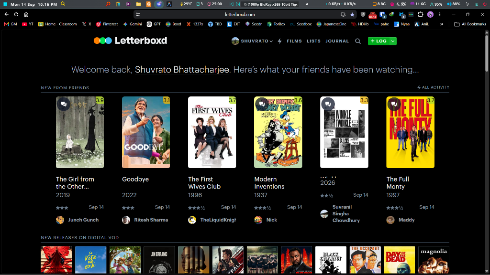
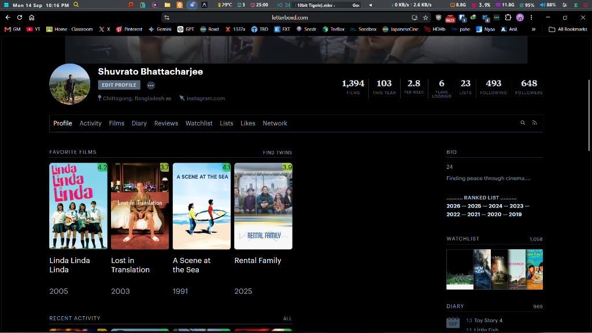

<h1 align="center">
  <br>
  Letterboxd Tweaks (Enhanced Edition)
</h1>

<p align="center">
  <strong>A personalized, enhanced version of the popular Letterboxd Tweaks extension.</strong>
</p>

## ✨ What's New in this Enhanced Edition?

I have forked the original Letterboxd Tweaks repository and made several aesthetic improvements for a cleaner, sleeker experience:

1. **AMOLED Black Background** 🖤 
   - Forced a true `#000000` black background across Letterboxd's wrapper, header, footer, and body to save battery and look stunning on OLED displays.
2. **Removed Ambient Shadows** 🚫
   - Disabled the blurred clone images that created messy ambient glows behind film cards.
3. **Slimmer Film Cards** 📏
   - Removed the bulky, translucent background padding around film cards, restoring native Letterboxd poster sizes so they no longer push down or cut off movie titles.
4. **Minimalist Rating Badges** 🏷️
   - Reduced the size, padding, and minimum width of the injected green/colorful rating badges so they take up less space on the posters.

### Enhanced Edition Screenshots

#### Home Page


#### Profile Page


---

## 🛠️ Original Features (Letterboxd Tweaks)

<a href="https://www.buymeacoffee.com/jserwatka" target="_blank"></a>

# Letterboxd Tweaks
<a href="https://addons.mozilla.org/pl/firefox/addon/letterboxd-tweaks/" target="_blank"></a>
<a href="https://chromewebstore.google.com/detail/letterboxd-tweaks/hopfbphfhmjgdnedoldfpbhepohibfkj" target="_blank"></a>

## Description
This Chrome extension/Firefox add-on enhances the Letterboxd website with cleaner movie cards, a more efficient search bar featuring instant movie suggestions, and an improved user interface that hides unnecessary filters, navbar items, and sort options, along with other quality of life improvements.


- Hide useless filters, sort options and nav items
  

## Future Improvements
- Display the cast member's image when hovering over their name. (https://github.com/JSerwatka/letterboxd-tweaks/issues/25)
- Automatically add a movie to the diary after rating it. (https://github.com/JSerwatka/letterboxd-tweaks/issues/26)
- Show an indicator if a movie is already in the watchlist. (https://github.com/JSerwatka/letterboxd-tweaks/issues/27)
- Allow removing a movie from a list directly from the movie component. (https://github.com/JSerwatka/letterboxd-tweaks/issues/28)
- Add keyboard shortcuts for search and make it a command component. (https://github.com/JSerwatka/letterboxd-tweaks/issues/29)

If you have ideas for further improvements, please email them to jserwatka.dev@gmail.com or create an issue on this repository.

# Getting Started
1. Check if your `Node.js` version is >= **14**
2. Clone this repo and `cd` into it
   ```shell
   git clone https://github.com/JSerwatka/letterboxd-tweaks.git
   cd letterboxd-tweaks
   ```
3. Install the dependencies
   ```shell
   npm i
   ```
4. Build the project in dev mode

   ```shell
   npm run dev
   ```

5. Enable `Developer mode` in your `Manage Extensions` tab
6. Click `Load unpacked`, and select `letterboxd-tweaks/build` folder

  
# Build with

- Chrome Extension with Vite template from [create-chrome-ext](https://github.com/guocaoyi/create-chrome-ext)

- SolidJS


