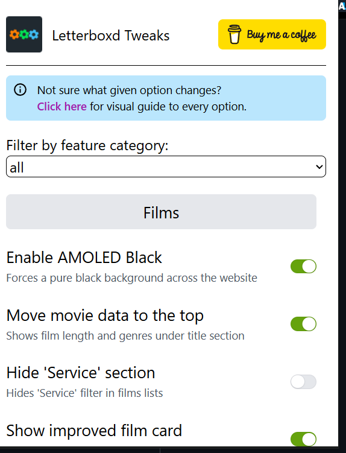
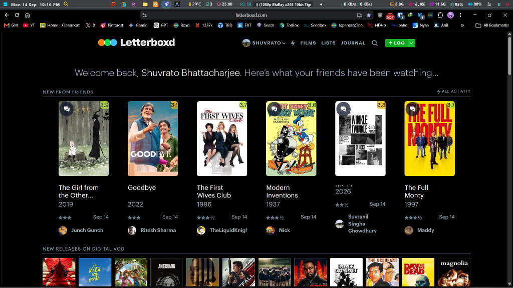
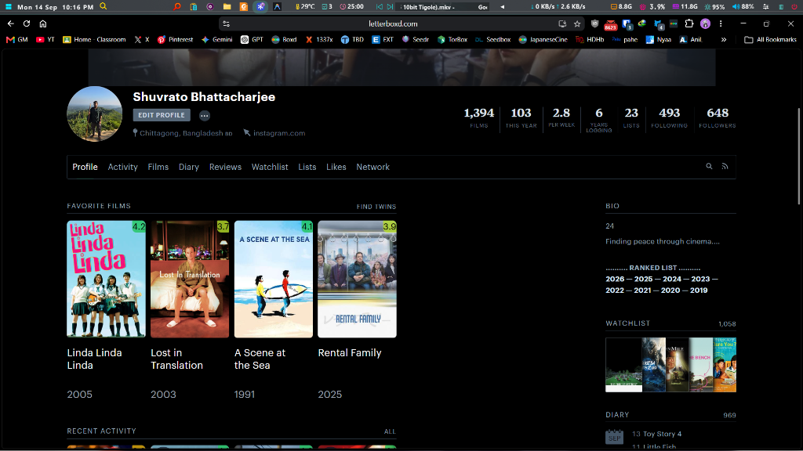
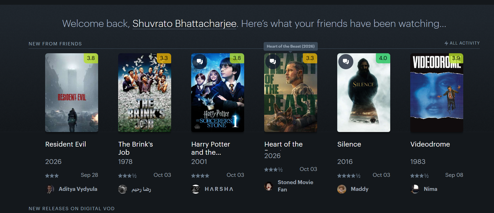
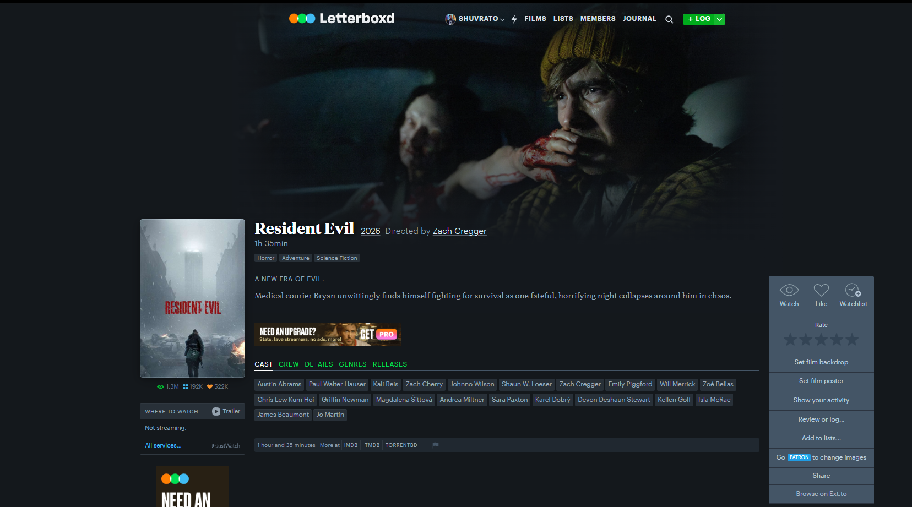
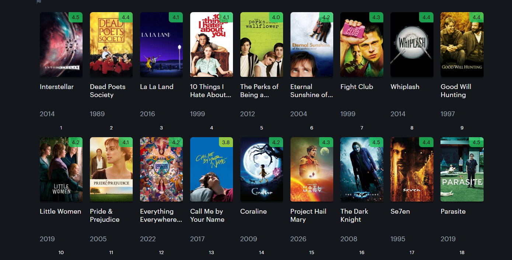

<h1 align="center">
  <br>
  Letterboxd Tweaks (Enhanced Edition)
</h1>

<p align="center">
  <strong>A personalized, enhanced version of the popular Letterboxd Tweaks extension.</strong>
</p>

## ✨ What's New in this Enhanced Edition?

This is a personal fork of the original Letterboxd Tweaks extension, adding several aesthetic improvements for a cleaner, sleeker experience:

1. **AMOLED Black Background Option** 🖤 
   - A toggleable option in the extension popup to force a true `#000000` black background across Letterboxd's wrapper, header, footer, and body. Saves battery and looks stunning on OLED displays.
2. **Removed Ambient Shadows** 🚫
   - Disabled the blurred clone images that created messy ambient glows behind film cards.
3. **Slimmer Film Cards** 📏
   - Removed the bulky, translucent background padding around film cards, restoring native Letterboxd poster sizes so they no longer push down or cut off movie titles.
4. **Minimalist Rating Badges** 🏷️
   - Reduced the size, padding, and minimum width of the injected green/colorful rating badges so they take up less space on the posters.

### Enhanced Edition Screenshots

#### Extension Popup (New Settings)


#### AMOLED Black Home Page


#### AMOLED Black Profile Page


#### Home Feed (Friend's Activity)


#### Film Detail Page


#### Film Grid


---

## 🛠️ Original Features (Letterboxd Tweaks)

This extension builds upon the excellent original [Letterboxd Tweaks](https://github.com/JSerwatka/letterboxd-tweaks) by JSerwatka. 

It enhances the Letterboxd website with cleaner movie cards, a more efficient search bar featuring instant movie suggestions, and an improved user interface that hides unnecessary filters, navbar items, and sort options, along with other quality of life improvements.

### Getting Started (Development)
1. Check if your `Node.js` version is >= **14**
2. Clone this repo and `cd` into it
   ```shell
   git clone https://github.com/shuvratobh/letterboxd-tweaks-enhanced.git
   cd letterboxd-tweaks-enhanced
   ```
3. Install the dependencies
   ```shell
   npm i
   ```
4. Build the project in dev mode

   ```shell
   npm run dev
   ```

5. Enable `Developer mode` in your browser's `Manage Extensions` tab
6. Click `Load unpacked`, and select the `build` folder.
